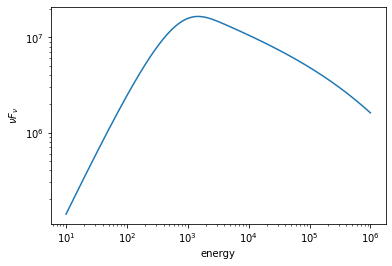
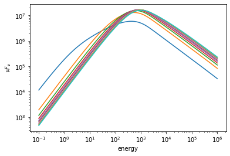

[](https://travis-ci.org/grburgess/pynchrotron)
[](https://codecov.io/gh/grburgess/pynchrotron)
[](https://doi.org/10.5281/zenodo.3544259)

# pynchrotron


Implements synchrotron emission from cooling electrons. This is the model used in [Burgess et al (2019)](https://www.nature.com/articles/s41550-019-0911-z?utm_source=feedburner&utm_medium=feed&utm_campaign=Feed%3A+natastron%2Frss%2Fcurrent+%28Nature+Astronomy%29&utm_content=Google+Feedfetcher). Please cite if you find this code useful for your research.

* This code gets rid of the need for GSL which was originally relied on for a quick computation of the of the synchrotron kernel which is an integral over a  Bessel function. 
* This code has been ported from GSL and written directly in python as well as accelerated with numba
* An astromodels function is also supplied for direct use in 3ML.


## Usage

```python
import numpy as np
import matplotlib as mpl
import matplotlib.pyplot as plt
%matplotlib inline 

import pynchrotron
```

    /Users/jburgess/.environs/pynchro/lib/python3.7/site-packages/astromodels/core/parameter.py:555: UserWarning: We have set the min_value of K to 1e-99 because there was a postive transform
      warnings.warn('We have set the min_value of %s to 1e-99 because there was a postive transform' % self.path)
    /Users/jburgess/.environs/pynchro/lib/python3.7/site-packages/astromodels/core/parameter.py:555: UserWarning: We have set the min_value of xc to 1e-99 because there was a postive transform
      warnings.warn('We have set the min_value of %s to 1e-99 because there was a postive transform' % self.path)


## Create an astromodels model


```python
model = pynchrotron.SynchrotronNumerical()

model


```


<ul>

<li>description: Synchrotron emission from cooling electrions</li>

<li>formula: $  $</li>

<li>parameters: 
<ul>

<li>K: 
<ul>

<li>value: 1.0</li>

<li>desc: normalization</li>

<li>min_value: 0.0</li>

<li>max_value: None</li>

<li>unit: </li>

<li>is_normalization: False</li>

<li>delta: 0.1</li>

<li>free: True</li>

</ul>

</li>

<li>B: 
<ul>

<li>value: 100.0</li>

<li>desc: energy scaling</li>

<li>min_value: 0.01</li>

<li>max_value: None</li>

<li>unit: </li>

<li>is_normalization: False</li>

<li>delta: 10.0</li>

<li>free: True</li>

</ul>

</li>

<li>index: 
<ul>

<li>value: 3.5</li>

<li>desc: spectral index of electrons</li>

<li>min_value: 2.0</li>

<li>max_value: 6.0</li>

<li>unit: </li>

<li>is_normalization: False</li>

<li>delta: 0.35000000000000003</li>

<li>free: True</li>

</ul>

</li>

<li>gamma_min: 
<ul>

<li>value: 500000.0</li>

<li>desc: minimum electron lorentz factor</li>

<li>min_value: 1.0</li>

<li>max_value: None</li>

<li>unit: </li>

<li>is_normalization: False</li>

<li>delta: 50000.0</li>

<li>free: False</li>

</ul>

</li>

<li>gamma_cool: 
<ul>

<li>value: 90000000.0</li>

<li>desc: cooling time of electrons</li>

<li>min_value: None</li>

<li>max_value: None</li>

<li>unit: </li>

<li>is_normalization: False</li>

<li>delta: 9000000.0</li>

<li>free: True</li>

</ul>

</li>

<li>gamma_max: 
<ul>

<li>value: 100000000.0</li>

<li>desc: minimum electron lorentz factor</li>

<li>min_value: 1000000.0</li>

<li>max_value: None</li>

<li>unit: </li>

<li>is_normalization: False</li>

<li>delta: 10000000.0</li>

<li>free: False</li>

</ul>

</li>

<li>bulk_gamma: 
<ul>

<li>value: 1.0</li>

<li>desc: bulk Lorentz factor</li>

<li>min_value: 1.0</li>

<li>max_value: None</li>

<li>unit: </li>

<li>is_normalization: False</li>

<li>delta: 0.1</li>

<li>free: False</li>

</ul>

</li>

</ul>

</li>

</ul>


## Plot the model


```python
fig, ax = plt.subplots()


ene = np.logspace(1,6,400)

ax.loglog(ene, ene**2 * model(ene))
ax.set_xlabel('energy')
ax.set_ylabel(r'$\nu F_{\nu}$')
```


    Text(0, 0.5, '$\\nu F_{\\nu}$')





```python
fig, ax = plt.subplots()

gamma_min = 500000.

gamma_cool = np.linspace(.1 * gamma_min, 5* gamma_min, 10)


ene = np.logspace(-1,6,400)

for gc in gamma_cool:
    model.gamma_cool = gc
    model.gamma_min = gamma_min
    
    ax.loglog(ene, ene**2 * model(ene))
ax.set_xlabel('energy')
ax.set_ylabel(r'$\nu F_{\nu}$')
```


    Text(0, 0.5, '$\\nu F_{\\nu}$')




